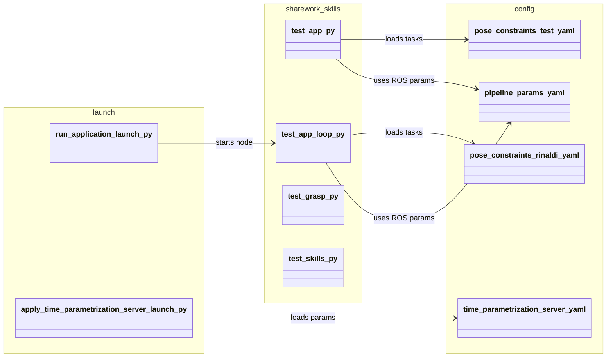
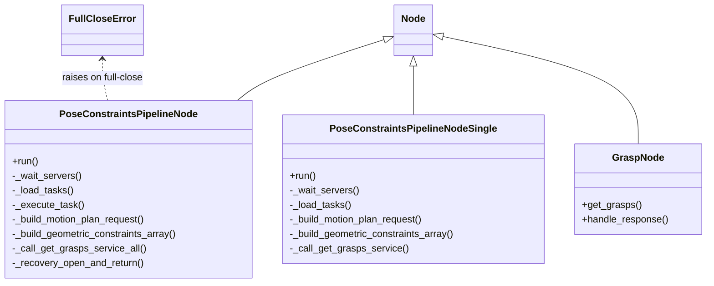

# sharework_skills (`bt-pipeline` branch)

ROS 2 package for testing a constrained motion pipeline with grasp detection and gripper control.

## Package overview

- **Main package path**: `sharework_skills/`
- **Main runtime nodes**:
  - `sharework_skills/test_app.py`: single-pass constrained task pipeline
  - `sharework_skills/test_app_loop.py`: robust pick&place loop with grasp recomputation and recovery
  - `sharework_skills/test_grasp.py`: standalone grasp service test/publisher
- **Launch files**:
  - `launch/run_application.launch.py`
  - `launch/apply_time_parametrization_server.launch.py`
- **Config files** (examples):
  - `config/pipeline_params.yaml`
  - `config/pose_constraints_rinaldi.yaml`
  - `config/pose_constraints_test.yaml`
  - `config/time_parametrization_server.yaml`

## Runtime flow (high level)

1. Load ROS parameters and task YAML.
2. Wait for joint states and required action/service servers.
3. Build geometric constraints (`plane`, `line`, `orientation`).
4. For each movement task:
   - plan (`/plan_with_constraints`)
   - apply time parametrization (`/apply_time_parametrization`)
   - execute (`/execute_trajectory`)
5. For grasping tasks:
   - call `/get_grasps`
   - publish TF helpers (`grasp_frame`, `approach_frame`)
   - command gripper through `/robotiq_action_controller/gripper_cmd`
6. In loop mode (`test_app_loop.py`), failures in suffix phase trigger recovery and full grasp recomputation.

## UML package diagram



## UML class diagram (core runtime classes)



## Launching

### 1) Run the constrained loop pipeline

```bash
ros2 launch sharework_skills run_application.launch.py \
  config_pkg:=sharework_skills \
  config_file:=config/pipeline_params.yaml \
  tasks_file:=config/pose_constraints_rinaldi.yaml
```

### 2) Run time parametrization server wrapper

```bash
ros2 launch sharework_skills apply_time_parametrization_server.launch.py \
  config_pkg:=sharework_skills \
  config_file:=config/time_parametrization_server.yaml
```

## Task YAML format

Each file must contain:

```yaml
tasks:
  - name: "task_name"
    type: "movement | gripper_control/Gripper | grasp_detection/GetGrasps"
    goal_configuration: [q1, q2, q3, q4, q5, q6]   # for joint-space motion
    # OR
    cartesian_goal:
      position: [x, y, z]
      orientation: [qx, qy, qz, qw]
      frame_id: "frame_name"
    geometric_constraints:
      - name: "c1"
        type: "plane | line | orientation"
        frame: "world"
```

## Main ROS interfaces used

- **Actions**:
  - `pose_constraints_msgs/action/PlanWithConstraints`
  - `time_parametrization_msgs/action/ApplyTimeParametrization`
  - `moveit_msgs/action/ExecuteTrajectory`
  - `control_msgs/action/GripperCommand`
- **Services**:
  - `grasp_detection_msgs/srv/GetGrasps`
- **Topics**:
  - `/joint_states`
  - `/grasp_poses`

## Notes

- `test_app_loop.py` adds:
  - retry logic on empty/low-quality grasps
  - FULL CLOSE detection (`full_close_position`, `full_close_tol`)
  - recovery strategy (`open + return`) after suffix failures
- Parameters are read under node name `pose_constraints_pipeline` from `pipeline_params.yaml`.
