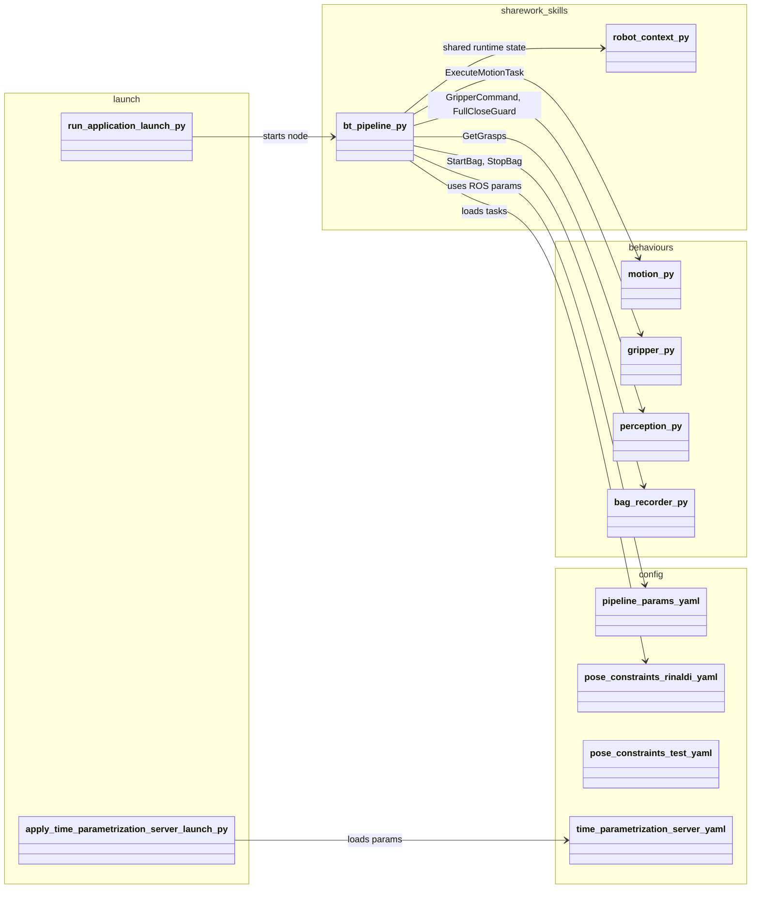
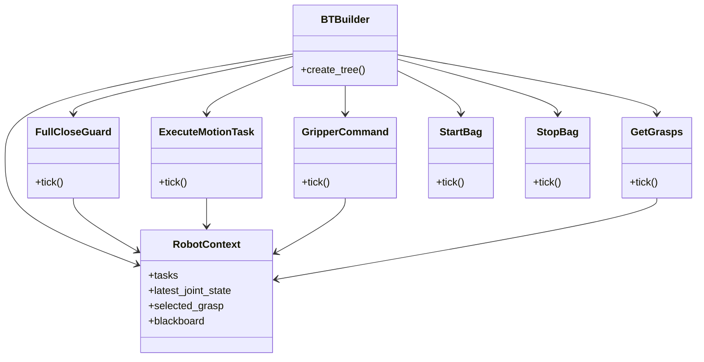

# sharework_skills (`bt-pipeline` branch)

ROS 2 package for testing a constrained motion pipeline with grasp detection and gripper control.

## Package overview

- **Main package path**: `sharework_skills/`
- **BT pipeline focus**:
  - `sharework_skills/bt_pipeline.py`
  - `from .robot_context import RobotContext`
  - `from .behaviours.motion import ExecuteMotionTask`
  - `from .behaviours.gripper import GripperCommand, FullCloseGuard`
  - `from .behaviours.perception import GetGrasps`
  - `from .behaviours.bag_recorder import StartBag, StopBag`
- **Current executable nodes in this repository snapshot**:
  - `sharework_skills/test_app.py`
  - `sharework_skills/test_app_loop.py`
  - `sharework_skills/test_grasp.py`
- **Launch files**:
  - `launch/run_application.launch.py`
  - `launch/apply_time_parametrization_server.launch.py`
- **Config files** (examples):
  - `config/pipeline_params.yaml`
  - `config/pose_constraints_rinaldi.yaml`
  - `config/pose_constraints_test.yaml`
  - `config/time_parametrization_server.yaml`

## Runtime flow (high level)

1. `bt_pipeline.py` builds the task tree and shares state through `RobotContext`.
2. `GetGrasps` handles perception and writes the selected grasp into context.
3. `ExecuteMotionTask` executes constrained motion actions.
4. `GripperCommand` executes open/close actions.
5. `FullCloseGuard` validates grasp closure state and triggers recovery transitions.
6. `StartBag` / `StopBag` wrap rosbag recording for experiment traces.

## UML package diagram



## UML class diagram (core runtime classes)



## Launching

### 1) Run the constrained loop pipeline

```bash
ros2 launch sharework_skills run_application.launch.py \
  config_pkg:=sharework_skills \
  config_file:=config/pipeline_params.yaml \
  tasks_file:=config/pose_constraints_rinaldi.yaml
```

### 2) Run time parametrization server wrapper

```bash
ros2 launch sharework_skills apply_time_parametrization_server.launch.py \
  config_pkg:=sharework_skills \
  config_file:=config/time_parametrization_server.yaml
```

## Task YAML format

Each file must contain:

```yaml
tasks:
  - name: "task_name"
    type: "movement | gripper_control/Gripper | grasp_detection/GetGrasps"
    goal_configuration: [q1, q2, q3, q4, q5, q6]   # for joint-space motion
    # OR
    cartesian_goal:
      position: [x, y, z]
      orientation: [qx, qy, qz, qw]
      frame_id: "frame_name"
    geometric_constraints:
      - name: "c1"
        type: "plane | line | orientation"
        frame: "world"
```

## Main ROS interfaces used

- **Actions**:
  - `pose_constraints_msgs/action/PlanWithConstraints`
  - `time_parametrization_msgs/action/ApplyTimeParametrization`
  - `moveit_msgs/action/ExecuteTrajectory`
  - `control_msgs/action/GripperCommand`
- **Services**:
  - `grasp_detection_msgs/srv/GetGrasps`
- **Topics**:
  - `/joint_states`
  - `/grasp_poses`

## Notes

- This README is now organized around the `bt_pipeline.py` split and its behavior modules.
- In the current repository snapshot, the concrete runtime logic is still visible in `test_app.py` and `test_app_loop.py`.
